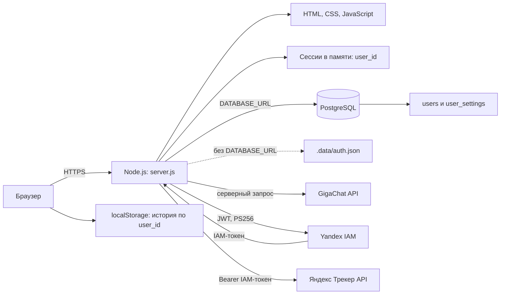

# Архитектура Task Helper

## Назначение

Task Helper — веб-прототип для формирования черновиков задач для Яндекс Трекера. Он получает справочники маршрутизации и создаёт подтверждённые задачи через API Tracker.

## Компоненты



- `server.js` — HTTP-сервер на встроенных модулях Node.js. Он раздаёт статические файлы и предоставляет API авторизации.
- `app.js` — клиентская логика: создание и проверка черновиков, профили маршрутизации, демонстрационная история.
- `styles.css` и `index.html` — интерфейс приложения.
- `scripts/migrate.js` — идемпотентная миграция PostgreSQL.

## Авторизация и хранение данных

Пользователь регистрируется по email, имени и паролю длиной от 12 символов. Сервер сохраняет не пароль, а PBKDF2-SHA-512 хеш с уникальной солью (600 000 итераций). Email уникален; сессия всегда содержит ID конкретного пользователя.

При наличии `DATABASE_URL` приложение использует таблицу `users` с email, отображаемым именем, PBKDF2-хешем пароля, уникальной солью и временем создания. Email уникален без учёта регистра, так как при регистрации и входе приводится к нижнему регистру.

Таблица `user_settings` хранит часовой пояс и приоритет по умолчанию. Часовой пояс применяется при расчёте относительных дат, а приоритет — если он не определён текстом или ответом модели. Все записи Tracker связаны с тем же `user_id`.

| Таблица | Назначение | Изоляция |
| --- | --- | --- |
| `users` | учётная запись и хеш пароля | одна запись на пользователя |
| `user_settings` | часовой пояс и приоритет по умолчанию | `user_id` — первичный и внешний ключ |
| `tracker_defaults` | очередь, проект, доска, спринт | `user_id` — первичный и внешний ключ |

### API учётной записи

- `POST /api/auth/register` — создаёт пользователя по `email`, `displayName` и `password`; сразу создаёт сессию.
- `POST /api/auth/login` — создаёт сессию для email и пароля.
- `POST /api/auth/logout` — завершает текущую сессию.
- `GET /api/auth/status` — возвращает состояние сессии и настройки текущего пользователя.
- `GET /api/account/settings` — возвращает профиль текущего пользователя.
- `POST /api/account/settings` — изменяет email, имя, часовой пояс и приоритет текущего пользователя.

Все endpoints, работающие с Tracker, получают пользователя только из серверной сессии. Идентификатор пользователя не принимается из тела запроса, поэтому пользователь не может запросить или изменить настройки другого пользователя.

### Миграция существующего рабочего пространства

`npm run db:migrate` добавляет в старую таблицу `users` столбцы `email` и `display_name`, создаёт `user_settings` и сохраняет исходный `user_id`. Старым записям временно назначаются адреса вида `legacy-<id>@local.invalid`. Пользователь может войти прежним паролем, не указывая email, если в базе ровно один такой legacy-аккаунт; после входа он должен заменить временный email в настройках профиля.

Сессии хранятся в памяти процесса восемь часов. При перезапуске приложения все активные сессии завершаются. Для масштабирования потребуется вынести сессии в Redis или аналогичное общее хранилище.

Если `DATABASE_URL` не задан, включается файловый fallback `.data/auth.json`. Он нужен только для локальной совместимости. В App Platform Timeweb файловая система исходного кода может быть недоступна для записи, поэтому для продакшена нужен PostgreSQL.

## Подключение Яндекс Трекера

Для федеративной организации используется общий сервисный аккаунт. В окружении сервера задаётся `YANDEX_TRACKER_SERVICE_ACCOUNT_KEY`: base64-представление JSON авторизованного ключа с полями `id`, `service_account_id` и `private_key`. Ключ не сохраняется в PostgreSQL и не передаётся в браузер.

Перед обращением к Tracker сервер формирует JWT с `alg: PS256`, `kid: id`, `iss: service_account_id`, `aud: https://iam.api.cloud.yandex.net/iam/v1/tokens` и сроком действия один час. JWT обменивается через `POST /iam/v1/tokens` на IAM-токен. IAM-токен передаётся в `Authorization: Bearer ...` и кэшируется в памяти до срока действия с запасом пять минут.

Для Tracker используется заголовок `X-Cloud-Org-Id: bpf7jl9ghb35o2idt8iq`; он задаётся по умолчанию и может быть изменён только через `YANDEX_TRACKER_ORG_ID`. Сервисный аккаунт должен быть видим в Tracker и добавлен в используемые очереди с требуемыми правами.

Таблица `tracker_defaults` хранит ключ очереди, ID проекта, доски и спринта по умолчанию для пользователя. Сервер запрашивает список очередей, проектов и досок только после аутентификации пользователя, а спринты — только для выбранной доски. В браузер передаются идентификаторы и названия справочников, но никогда не передаются ключ, JWT или IAM-токен.

При создании сервер валидирует обязательные базовые поля и отправляет `POST /v3/issues`. В параметр `unique` передаётся стабильный ID черновика: повторный запрос с тем же ID не создаёт дубликат. В ответ браузер получает только ключ и ссылку созданной задачи.

## Локальная разработка

Локальный PostgreSQL доступен на `127.0.0.1:5433`. Для разработки используется отдельная БД `task_helper_dev` и роль `task_helper`.

1. Скопируйте `.env.example` в `.env`.
2. Укажите пароль роли в `DATABASE_URL`; спецсимволы в пароле должны быть URL-кодированы.
3. Запустите миграцию: `npm run db:migrate`.
4. Запустите приложение: `npm start`.

`.env` не должен попадать в Git. Переменная `DATABASE_SSL=false` используется локально.

## Продакшен в Timeweb

Приложение развёрнуто в Timeweb App Platform из ветки `main`. Автодеплой запускается после `git push` в эту ветку.

В production используется PostgreSQL 15 DBaaS. В текущем контуре App Platform не имеет маршрута к приватному адресу кластера, поэтому для соединения включены публичный IPv4 базы и обязательный TLS. Это создаёт отдельный платный плавающий IP; его стоимость и необходимость следует проверять в панели Timeweb перед включением.

### Настройка базы

1. Создайте кластер PostgreSQL и логическую БД для приложения.
2. Создайте пользователя БД с правами `SELECT`, `INSERT`, `UPDATE`, `DELETE`, `CREATE`, `TRUNCATE`, `REFERENCES`, `TRIGGER`, `TEMPORARY` и `CONNECT` для этой БД.
3. Включите публичный IPv4 и обязательный TLS, если нет приватного сетевого маршрута от App Platform к кластеру.
4. Скопируйте внешний хост, порт, имя БД и учётные данные из панели. Не передавайте пароль в чат и не добавляйте его в репозиторий.
5. Выполните миграции до первого запуска приложения с этой БД:

```powershell
$env:DATABASE_URL='postgresql://<user>:<url-encoded-password>@<host>:5432/<database>'
$env:DATABASE_SSL='true'
npm run db:migrate
```

Команда создаёт или обновляет таблицы `users`, `user_settings` и `tracker_defaults` идемпотентно. Она также безопасно переводит существующую однопользовательскую установку на новую модель. Параметр пароля в URL кодируется: например, `@` заменяется на `%40`.

### Переменные окружения App Platform

В панели Timeweb задайте:

```text
DATABASE_URL=postgresql://<user>:<url-encoded-password>@<host>:5432/<database>
DATABASE_SSL=true
HOST=0.0.0.0
COOKIE_SECURE=true
YANDEX_TRACKER_SERVICE_ACCOUNT_KEY=<base64-encoded-authorized-key-json>
YANDEX_TRACKER_ORG_ID=bpf7jl9ghb35o2idt8iq
GIGACHAT_CREDENTIALS=<authorization-key>
GIGACHAT_SCOPE=GIGACHAT_API_PERS
GIGACHAT_MODEL=GigaChat-2-Pro
GIGACHAT_BASE_URL=https://gigachat.devices.sberbank.ru/api/v1
```

`DATABASE_URL`, `YANDEX_TRACKER_SERVICE_ACCOUNT_KEY` и `GIGACHAT_CREDENTIALS` — секреты: их нельзя хранить в репозитории или выводить в логи. В интерфейсе Timeweb значения переменных окружения маскируются. Изменение переменных окружения через используемый MCP недоступно, поэтому добавлять и менять их нужно в панели Timeweb. После изменения переменных приложение необходимо перезапустить.

### Проверка и диагностика

После миграций и перезапуска откройте `/`: должна отображаться форма входа или основной интерфейс. Статус приложения в панели должен быть `active`.

- `connect ETIMEDOUT <private-ip>:5432` в логах означает, что App Platform не может достичь приватного адреса базы. Проверьте сетевой маршрут либо включите внешний доступ и обновите хост в `DATABASE_URL`.
- `relation "users" does not exist` означает, что соединение с PostgreSQL установлено, но на этой БД не выполнена `npm run db:migrate`.
- После изменения хоста, пароля или TLS в `DATABASE_URL` выполните миграцию для новой базы и перезапустите приложение.

## GigaChat

`POST /api/drafts/generate` доступен только после входа и принимает текст задачи с активным профилем маршрутизации. Сервер формирует строгий JSON с заголовком, описанием, дедлайном, приоритетом, исполнителем, наблюдателем и уверенностью. Ответ проверяется перед передачей браузеру.

Промт хранится в `prompts/task-draft.js`, а не в обработчике API. Перед вызовом модели сервер нормализует часть относительных дат. Правило для текущего пилота: «до конца недели» означает ближайшую пятницу в часовом поясе профиля; нормализованная дата передаётся модели и принудительно сохраняется в ответе.

Нужные переменные окружения: `GIGACHAT_CREDENTIALS`, `GIGACHAT_SCOPE`, `GIGACHAT_MODEL` и `GIGACHAT_BASE_URL`. Authorization Key хранится только в `.env` или в защищённом хранилище окружения. Для проверки TLS используется публичный корневой сертификат НУЦ Минцифры в `certs/russian_trusted_root_ca_pem.crt`; проверка сертификата не отключается.

В GigaChat передаются только текст задачи и несекретные параметры профиля. Токены Яндекс Трекера, пароли, строки подключения к БД и иные секреты в запросы модели не включаются.

## Ограничения прототипа

- История демо-задач хранится в `localStorage`, а не в PostgreSQL; ключ хранилища включает `user_id`, поэтому она разделена между аккаунтами на одном браузере.
- Пользователи поддержаны, но роли, приглашения, двухфакторная аутентификация, восстановление и смена пароля пока не реализованы.
- База не создаётся автоматически при старте приложения: это делает явная команда миграции.
- Сессии хранятся в памяти одного процесса, поэтому при перезапуске все пользователи входят заново; горизонтальное масштабирование потребует общего хранилища сессий.
- IAM-токен существует только в памяти процесса. При перезапуске он запрашивается заново; замена или отзыв авторизованного ключа требует обновить защищённую переменную и перезапустить приложение.
