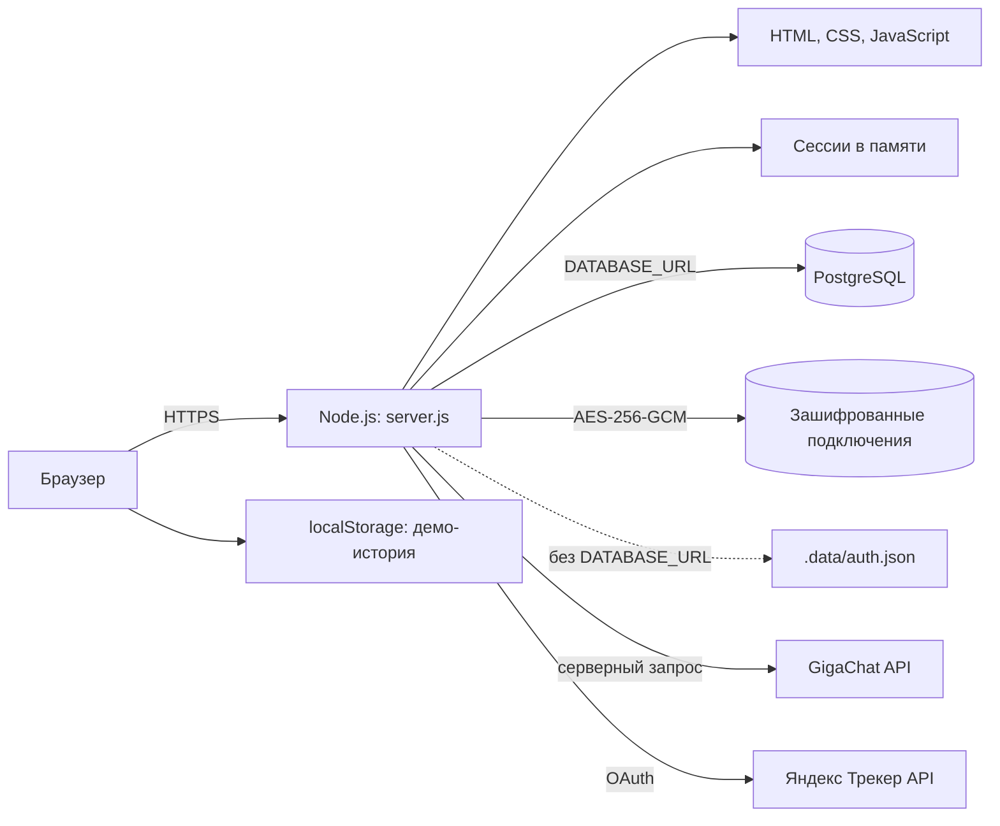

# Архитектура Task Helper

## Назначение

Task Helper — веб-прототип для формирования черновиков задач для Яндекс Трекера. Он получает справочники маршрутизации и создаёт подтверждённые задачи через API Tracker.

## Компоненты



- `server.js` — HTTP-сервер на встроенных модулях Node.js. Он раздаёт статические файлы и предоставляет API авторизации.
- `app.js` — клиентская логика: создание и проверка черновиков, профили маршрутизации, демонстрационная история.
- `styles.css` и `index.html` — интерфейс приложения.
- `scripts/migrate.js` — идемпотентная миграция PostgreSQL.

## Авторизация и хранение данных

При первом входе пользователь задаёт пароль длиной от 12 символов. Сервер сохраняет не пароль, а PBKDF2-SHA-512 хеш с уникальной солью (600 000 итераций).

При наличии `DATABASE_URL` приложение использует таблицу `users` с идентификатором записи, PBKDF2-хешем пароля, уникальной солью и временем создания.

Сессии хранятся в памяти процесса восемь часов. При перезапуске приложения все активные сессии завершаются. Для масштабирования потребуется вынести сессии в Redis или аналогичное общее хранилище.

Если `DATABASE_URL` не задан, включается файловый fallback `.data/auth.json`. Он нужен только для локальной совместимости. В App Platform Timeweb файловая система исходного кода может быть недоступна для записи, поэтому для продакшена нужен PostgreSQL.

## Подключения Яндекс Трекера

Параметры подключения относятся к текущему пользователю и сохраняются в таблице `tracker_connections`, связанной с `users`. Значения `OAuth-токена`, ID организации и типа заголовка сериализуются и шифруются AES-256-GCM до записи в БД. Ключ `TRACKER_ENCRYPTION_KEY` — 32-байтный ключ в base64 — задаётся только в окружении сервера и не хранится в БД или репозитории.

API возвращает только факт наличия подключения и дату изменения; токен не возвращается после сохранения. Удаление подключения удаляет зашифрованную запись. Настройка подключений недоступна без PostgreSQL: файловый fallback для токенов не используется.

Таблица `tracker_defaults` хранит ключ очереди, ID проекта, доски и спринта по умолчанию для пользователя. Сервер запрашивает список очередей, проектов и досок только после аутентификации пользователя, а спринты — только для выбранной доски. В браузер передаются идентификаторы и названия справочников, OAuth-токен остаётся на сервере.

При создании сервер валидирует обязательные базовые поля и отправляет `POST /v3/issues`. В параметр `unique` передаётся стабильный ID черновика: повторный запрос с тем же ID не создаёт дубликат. В ответ браузер получает только ключ и ссылку созданной задачи.

## Локальная разработка

Локальный PostgreSQL доступен на `127.0.0.1:5433`. Для разработки используется отдельная БД `task_helper_dev` и роль `task_helper`.

1. Скопируйте `.env.example` в `.env`.
2. Укажите пароль роли в `DATABASE_URL`; спецсимволы в пароле должны быть URL-кодированы.
3. Запустите миграцию: `npm run db:migrate`.
4. Запустите приложение: `npm start`.

`.env` не должен попадать в Git. Переменная `DATABASE_SSL=false` используется локально.

## Продакшен в Timeweb

Приложение развёрнуто в Timeweb App Platform из ветки `main`. Автодеплой запускается после `git push` в эту ветку.

Текущий продакшен не подключён к PostgreSQL. Перед публикацией кода с новой схемой нужно создать PostgreSQL DBaaS, выполнить миграцию для продовой БД и задать в App Platform:

```text
DATABASE_URL=postgresql://...
DATABASE_SSL=true
HOST=0.0.0.0
COOKIE_SECURE=true
TRACKER_ENCRYPTION_KEY=<base64-encoded-32-byte-key>
```

`DATABASE_URL` — секрет: его нельзя хранить в репозитории или выводить в логи. В интерфейсе Timeweb значения переменных окружения маскируются. Изменение переменных окружения через используемый MCP недоступно, поэтому добавлять их нужно в панели Timeweb либо при создании нового приложения.

## GigaChat

`POST /api/drafts/generate` доступен только после входа и принимает текст задачи с активным профилем маршрутизации. Сервер формирует строгий JSON с заголовком, описанием, дедлайном, приоритетом, исполнителем, наблюдателем и уверенностью. Ответ проверяется перед передачей браузеру.

Промт хранится в `prompts/task-draft.js`, а не в обработчике API. Перед вызовом модели сервер нормализует часть относительных дат. Правило для текущего пилота: «до конца недели» означает ближайшую пятницу в часовом поясе профиля; нормализованная дата передаётся модели и принудительно сохраняется в ответе.

Нужные переменные окружения: `GIGACHAT_CREDENTIALS`, `GIGACHAT_SCOPE`, `GIGACHAT_MODEL` и `GIGACHAT_BASE_URL`. Authorization Key хранится только в `.env` или в защищённом хранилище окружения. Для проверки TLS используется публичный корневой сертификат НУЦ Минцифры в `certs/russian_trusted_root_ca_pem.crt`; проверка сертификата не отключается.

В GigaChat передаются только текст задачи и несекретные параметры профиля. Токены Яндекс Трекера, пароли, строки подключения к БД и иные секреты в запросы модели не включаются.

## Ограничения прототипа

- Нет интеграции с API Яндекс Трекера и защищённого сервисного токена.
- История демо-задач хранится в `localStorage`, а не в PostgreSQL.
- Поддержан один пароль для текущего рабочего пространства; полноценные пользователи, роли и восстановление пароля пока не реализованы.
- База не создаётся автоматически при старте приложения: это делает явная команда миграции.
